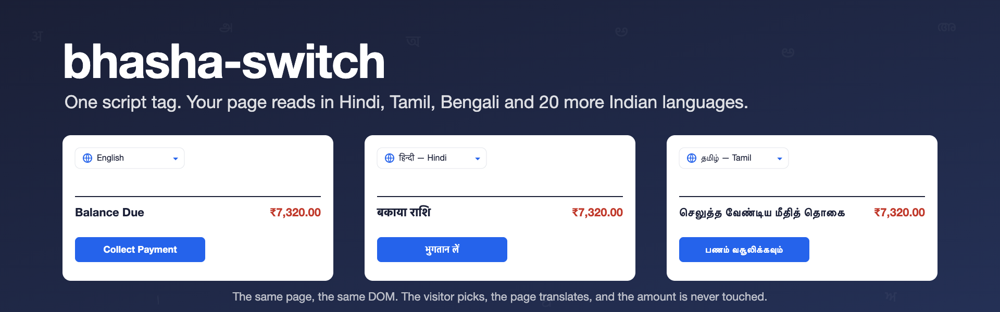
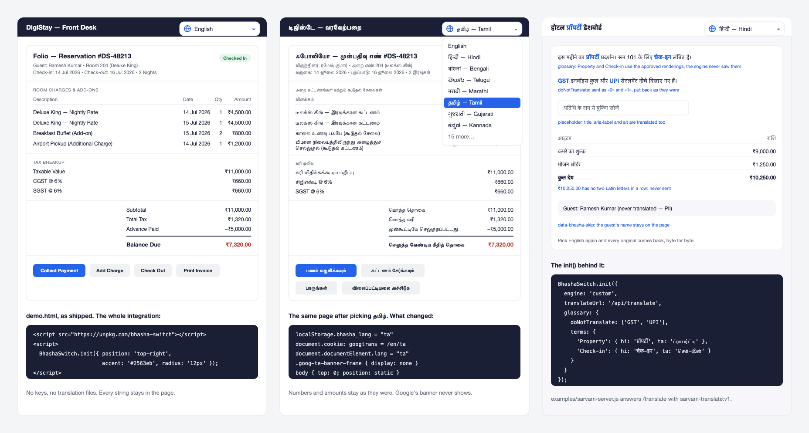
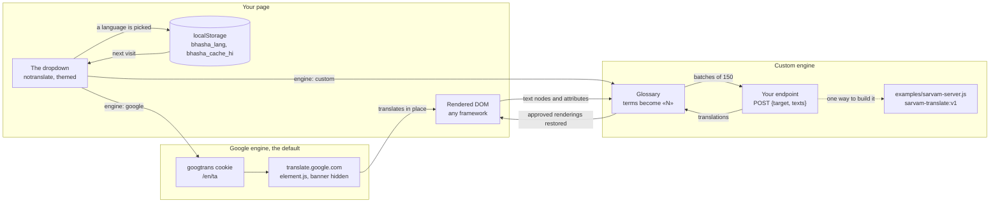

<div align="center">



<br>

**A language switcher for any web page. One script tag, and the page reads in Hindi, Tamil, Bengali or any of 23 Indian languages.<br>No translation files, no keys, no refactor.**

<br>

[](https://www.npmjs.com/package/bhasha-switch)
[](package.json)
[](src/index.js)
[](#run-it-on-your-machine)
[](#what-it-does)
<br>
[](#how-far-to-trust-it)
[](#how-far-to-trust-it)
[](#licence)

[What it does](#what-it-does) · [The rules it keeps](#the-rules-it-keeps) · [How far to trust it](#how-far-to-trust-it) · [How it works](#how-it-works) · [Run it yourself](#run-it-on-your-machine) · [Every option](#every-option)

</div>

<br>

<p align="center">
  
</p>

## Why bhasha-switch

India has 22 scheduled languages, and most people do not read English first. The usual way to serve them is an i18n library: pull every string out of the page into keys, keep a translation file per language, and maintain those files for as long as the product lives. That is days of work before a single word ships, and it is work a content site or a first version rarely gets.

bhasha-switch translates the page that is already rendered. By default it uses the free Google Translate widget, hides Google's banner, and draws a clean dropdown that remembers the visitor's choice. When Google's guesses are not good enough, the same dropdown can send text to your own endpoint instead, with a glossary that pins brand names, acronyms and the words of your trade. A hotel app's "Property" stays प्रॉपर्टी and never becomes जायदाद, the real-estate sense.

*Bhasha* (भाषा) is Hindi for *language*.

## What it does

| | |
|---|---|
| **One line to add** | A `<script>` tag or one `init()` call. React, Vue, Next.js, plain HTML: if it renders DOM, it works. |
| **English and 23 Indian languages** | All 22 scheduled languages plus Bhojpuri, each shown in its own script. Bodo has no Google model and appears only with the custom engine. Pass your own `languages` list to show fewer. |
| **A dropdown you can theme** | Accent, background, text and border colours, corner radius and font. Float it in any corner, or mount it inside your own navbar with `container`. |
| **Remembers the choice** | The language is saved in `localStorage` and applied before Google's engine boots, so a returning visitor sees their language at once. `<html lang>` is set to match. |
| **Hides Google's chrome** | The banner, the gadget, the tooltips and the page shift Google adds to `<body>` are all removed with CSS. |
| **Switches live where it can** | Picking a language drives Google's hidden select without a reload. If that fails, or if you set `reloadOnSwitch`, the page reloads. |
| **Your own engine** | `engine: 'custom'` sends text nodes and `placeholder`, `title`, `aria-label` and `alt` attributes to your `translateUrl` in batches of 150, applies the results, watches the DOM for new content, and caches each language in `localStorage`. Switching back to English restores every original exactly. |
| **A glossary** | `doNotTranslate` terms pass through untouched. `terms` give an approved rendering per language. Matches are swapped for `«N»` placeholders before the call and restored after, longest term first and never mid-word, so `GST` does not match `GSTIN`. |
| **Skips what you mark** | Anything inside `translate="no"`, `.notranslate` or `data-bhasha-skip` is never sent. Nor are `<script>`, `<style>`, `<noscript>`, `<textarea>` and `<code>`, nor strings without two Latin letters in a row, which keeps `₹10,250.00` and `204` out of every request. |
| **A reference server** | [`examples/sarvam-server.js`](examples/sarvam-server.js): a zero-dependency proxy over Sarvam AI's `sarvam-translate:v1`, which covers all 22 scheduled languages including Bodo. |

## The rules it keeps

- **It never translates its own menu.** The dropdown is marked `notranslate`, whichever engine is on.
- **It never stacks widgets.** `init()` removes any widget it already drew, so React StrictMode's double call is harmless.
- **The custom engine keeps the originals.** Every text node and attribute it changes is remembered, and switching to the source language puts them back byte for byte.
- **Glossary words never reach the engine.** They travel as `«N»` placeholders. A whole string that is itself a glossary term is not sent at all.
- **What you mark as skipped is never sent.** Names, emails and anything else under `data-bhasha-skip` stay on the page.
- **One file, no dependencies, no build step.** `src/index.js` is what npm, unpkg and the demos load.
- **Zero cost on repeat visits.** Each language's translations are cached in `localStorage`, so the endpoint is asked once per string.

## How far to trust it

> [!IMPORTANT]
> **What is on npm is older than what is here.** `bhasha-switch@0.1.1` was published on 16 July 2026 and has the Google engine only (9 KB, 3.6 KB gzipped). The custom engine and the glossary landed on `master` on 17 August 2026 in [pull request #1](https://github.com/vishalmeena2211/bhasha-switch/pull/1) and have not been released. To use them today, load [`src/index.js`](src/index.js) from this repository. Publishing them is the first item on the roadmap.

What the Google engine is: a wrapper over the free Google Translate website widget. It is not a paid API with a service level, and Google can change or remove it. Machine translation reads well but is imperfect on short, ambiguous labels such as "Qty", and it may transliterate acronyms. Review the strings that matter. The first translation needs a network round trip to Google.

What has been tested: [`test.js`](test.js) drives both demos in headless Chromium with Playwright and checks six things. The Google engine shows the dropdown with no banner, switches the folio page to Tamil, and comes back Tamil after a reload. The custom engine, against a mock endpoint that echoes text with a `[hi]` prefix, renders glossary terms, passes `GST` and `UPI` through, keeps `₹10,250.00` and the guest's name untouched, translates a placeholder, and restores the English page exactly. The glossary helpers round-trip a placeholder. **The Sarvam server has not been exercised by that test**, and no real site has reported back yet.

Two limits to know: whole-number strings are never sent, but a number inside a sentence travels with the sentence. And the glossary's word-boundary check uses a regular-expression lookbehind, so a page with a glossary needs a browser that supports it (Safari 16.4 or newer, and any current Chrome or Firefox).

## How it works



With the Google engine, bhasha-switch sets the `googtrans` cookie Google reads (`/en/ta` for English to Tamil), loads Google's `element.js` into a hidden host element, hides every piece of Google's chrome, and drives Google's own select when the dropdown changes. With the custom engine it does the work itself: walks the DOM, protects glossary terms, posts batches to your endpoint, writes the answers back, and re-runs on a 300 ms debounce whenever the DOM changes.

| Part | What it is |
|---|---|
| [`src/index.js`](src/index.js) | The whole library: the language list, the Google engine, the glossary, the custom engine, the dropdown, and `init` and `setLanguage` |
| [`examples/sarvam-server.js`](examples/sarvam-server.js) | A Node server that answers `POST /translate` with Sarvam's `sarvam-translate:v1`. Maps the three codes Sarvam spells differently (`or`, `gom`, `mni-Mtei`), caches in memory, caps a request at 300 strings of 1,500 characters. No auth or rate limit: add your own before exposing it |
| [`demo.html`](demo.html) | A hotel folio page with the Google engine, the one in the screens above |
| [`demo-custom.html`](demo-custom.html) | The same idea with the custom engine and a glossary, against a mock endpoint |
| [`test.js`](test.js) | Serves both demos on `127.0.0.1:8200`, drives them with Playwright, and saves `proof-*.png` screenshots |

## Run it on your machine

```bash
npm install bhasha-switch
```

Or with no install at all:

```html
<script src="https://unpkg.com/bhasha-switch"></script>
<script>
  BhashaSwitch.init({ position: 'top-right', accent: '#2563eb' });
</script>
```

In React or Next.js, call it once in a client component so it runs in the browser:

```jsx
import { useEffect } from 'react';
import BhashaSwitch from 'bhasha-switch';

export default function App() {
  useEffect(() => {
    BhashaSwitch.init({ position: 'top-right', accent: '#2563eb', radius: '12px' });
  }, []);
  return <YourApp />;
}
```

In Vue 3:

```js
import { onMounted } from 'vue';
import BhashaSwitch from 'bhasha-switch';

onMounted(() => BhashaSwitch.init({ accent: '#2563eb' }));
```

That is the whole integration. A dropdown appears, and the page translates on selection. From your own code, `BhashaSwitch.setLanguage('ta')` switches to Tamil and `BhashaSwitch.LANGUAGES` is the full list.

### Fewer languages

```js
BhashaSwitch.init({
  languages: [
    { code: 'en', label: 'English', native: 'English' },
    { code: 'hi', label: 'Hindi',   native: 'हिन्दी' },
    { code: 'ta', label: 'Tamil',   native: 'தமிழ்' },
  ],
});
```

### Your own engine, with a glossary

```js
BhashaSwitch.init({
  engine: 'custom',
  translateUrl: '/api/translate',
  glossary: {
    doNotTranslate: ['GST', 'UPI', 'MyBrand'],
    terms: {
      'Property': { hi: 'प्रॉपर्टी', ta: 'ப்ராபர்ட்டி' },
      'Check-in': { hi: 'चेक-इन' }
    }
  }
});
```

Your endpoint receives `POST { target: 'hi', texts: ['Total Due', '«0» Details'] }` and answers `{ results: { 'Total Due': { t: 'कुल देय' }, '«0» Details': { t: '«0» विवरण' } } }`. The `«N»` tokens are glossary placeholders; pass them through unchanged. To run the reference server on port 8787 (set `PORT` to change it):

```bash
SARVAM_API_KEY=sk_... node examples/sarvam-server.js
```

Then point `translateUrl` at `http://localhost:8787/translate`. Keys come from dashboard.sarvam.ai.

### The demos and the test

The test needs Playwright, which is not listed in `package.json`:

```bash
git clone https://github.com/vishalmeena2211/bhasha-switch.git && cd bhasha-switch
```

```bash
npm install playwright
```

```bash
npx playwright install chromium
```

```bash
npm test
```

To look at a demo without the test, serve the folder with any static server and open `demo.html`:

```bash
python3 -m http.server 8000
```

### Every option

| Option | Default | What it does |
|---|---|---|
| `languages` | English + 23 | The list to show, as `[{ code, label, native }]`. An entry with `customOnly: true` is hidden from the Google engine |
| `source` | `'en'` | The language the page is written in |
| `storageKey` | `'bhasha_lang'` | The `localStorage` key for the saved choice |
| `position` | `'top-right'` | Corner for the floating dropdown: `top-right`, `top-left`, `bottom-right`, `bottom-left` |
| `container` | `null` | A CSS selector. When set, the dropdown is mounted inside that element instead of floating |
| `reloadOnSwitch` | `false` | Google engine only. `true` always reloads on a switch; `false` swaps live when it can |
| `engine` | `'google'` | `'google'` or `'custom'` |
| `translateUrl` | `null` | Custom engine: the endpoint to `POST { target, texts }` to |
| `glossary` | `null` | Custom engine: `{ doNotTranslate: [...], terms: { Term: { hi: '...' } } }` |
| `attributes` | `placeholder`, `title`, `aria-label`, `alt` | Custom engine: which attributes are translated as well as text |
| `batchSize` | `150` | Custom engine: strings per request |
| `cachePrefix` | `'bhasha_cache_'` | Custom engine: `localStorage` key prefix, one key per language |
| `accent` | `'#2563eb'` | Colour of the globe icon and the caret |
| `bg`, `text`, `border` | `'#ffffff'`, `'#1a1f36'`, `'#e2e5ea'` | The dropdown's surface colours |
| `radius` | `'10px'` | The dropdown's corner radius |
| `fontFamily` | `'inherit'` | The dropdown's font |
| `zIndex` | `2147483000` | Stacking order of the floating dropdown |

## Repository layout

| Path | What is in it |
|---|---|
| [`src/index.js`](src/index.js) | The library. This one file is the npm package |
| [`examples/`](examples) | The Sarvam reference server |
| [`demo.html`](demo.html), [`demo-custom.html`](demo-custom.html) | The two demo pages |
| [`test.js`](test.js) | The Playwright test |
| [`assets/`](assets) | Earlier screenshots of the widget on real pages |
| [`.github/readme/`](.github/readme) | The images on this page |

## Roadmap

- [x] Google engine with hidden chrome, themed dropdown and a remembered choice
- [x] Custom engine through your own endpoint, with glossary and do-not-translate
- [x] Sarvam reference server covering all 22 scheduled languages
- [x] A Playwright test of both engines
- [ ] Publish the custom engine and glossary to npm
- [ ] List Playwright as a dev dependency so `npm test` works from a clean clone
- [ ] ESM and UMD builds
- [ ] A `<BhashaSwitch />` React component
- [ ] A glossary matcher that does not need lookbehind, for older Safari

## Contributing

Clone the repository, edit [`src/index.js`](src/index.js), and run `npm test`. Keep the file dependency-free and keep it one file. A change to how text is picked up or restored needs a line in `test.js` that would fail without it. Issues and pull requests are welcome at [github.com/vishalmeena2211/bhasha-switch](https://github.com/vishalmeena2211/bhasha-switch/issues).

## Credits

- **Google Translate's website widget**, which the default engine wraps.
- **[Sarvam AI](https://www.sarvam.ai)** and `sarvam-translate:v1`, behind the reference server.
- **[Playwright](https://playwright.dev)**, which runs the test.
- The custom engine and glossary were contributed by [Pranshu](https://github.com/pranshu26) in [pull request #1](https://github.com/vishalmeena2211/bhasha-switch/pull/1).

## Licence

**[MIT](LICENSE)**, © 2026 Vishal Meena. Use it, change it and share it, keeping the copyright notice. Google's and Sarvam's services keep their own terms.

## Words used here

| Word | What it means |
|---|---|
| **Engine** | What does the translating: Google's widget, or your own endpoint |
| **Glossary** | Words with a fixed answer. `doNotTranslate` keeps them as they are; `terms` gives one rendering per language |
| **Placeholder** | The `«N»` token that stands in for a glossary word while the text is at the engine |
| **Source language** | The language the page is written in. Picking it switches translation off |
| **Live swap** | Changing language without a reload, by driving Google's hidden select |
| **Scheduled language** | One of the 22 languages in the Eighth Schedule of India's constitution |
| **Skip mark** | `translate="no"`, `.notranslate` or `data-bhasha-skip`: text that is never sent |

<br>

<div align="center">
<sub>Built to make the Indian web speak everyone's language.</sub>
</div>
